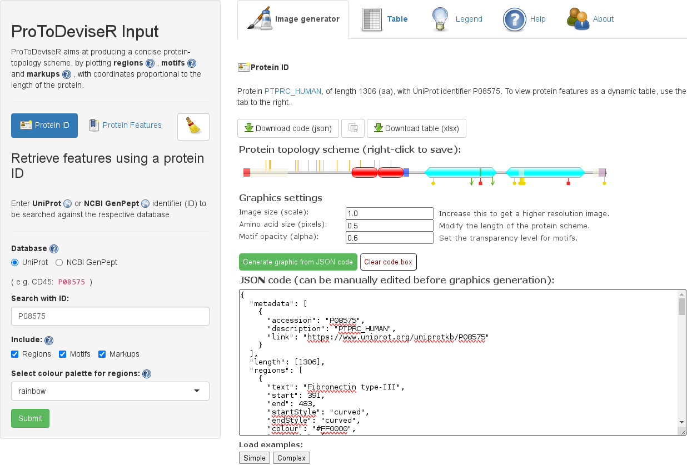

# ProToDeviseR
[Help](./inst/webApp/www/help.md) :: [Test dataset](./inst/webApp/www/cd45/) :: [About](./inst/webApp/www/about.md)

The **Pro**tein **To**pology **Devise**r is an **R** package for the automatic generation of protein topology code in JSON format. The code can be easily rendered into a graph, by Pfam's custom-domains generator. This excellent tool is **not** developed by us, but is embedded with the program for users' convenience. A table summary is also prepared. 

[](https://matrinet.shinyapps.io/ProToDeviser/)
[](https://doi.org/10.1186/s12859-025-06088-2)
[](https://github.com/Izzilab/protodeviser/releases/tag/1.0)

This is the R package of ProToDeviseR, which can be installed locally.
**If you are looking for the online version of the program (which requires no installation)**,
visit [https://matrinet.shinyapps.io/ProToDeviser/](https://matrinet.shinyapps.io/ProToDeviser/).

This work, as well as, the publication open access (OA) has been supported by:  

[](https://syopasaatio.fi/)
[](https://www.oulu.fi/en/research/creating-better-health-our-digital-health-knowhow)
[](https://www.cares-eu.org/)
[](https://www.oulu.fi/)
---
ProToDeviseR features a fully functional graphical user interface (UI), implemented in R Shiny:  


---
As an **input**, you can use:
* A UniProt identifier or an NCBI GenPept identifier.
* Raw results from several online resources for protein topology prediction
* A user-prepared table of protein topology annotations.

As an **output**, you get:
1. JSON code of protein features, ready to be processed into graphics in the *Image generator* tab.
2. A table summary of protein features.  

The protein features are classified as **regions**, **motifs** and **markups** (Figure 1). When searching with a database accession number (ID), all three are enabled by default:
- [x] **Regions**: structured domains, repeats or other relatively long (usually, but not always), functional parts of the protein.
- [x] **Motifs**: short liner motifs, disordered protein parts, signal peptides and transmembrane parts.
- [x] **Markups**: single-amino acid targes, such as glycosylation, phosphorylation, active or binding site, etc.

Different colour palettes for regions (domains) are provided, for users' preference.

  
**Figure 1. Automatic annotation of CD45 protein topology**. Identifier `P08575` was searched against UniProt by ProToDeviseR. Table and JSON code were automatically generated and graphic was rendered in the *Image generator* tab. Regions, motifs and markups are indicated.

## Dependencies and installation
ProToDeviser and its R dependencies can be installed as shown in the code box below. Depending on your system, you may need to also install system dependencies (outside R) required by them.

* [Click here](./inst/webApp/www/deps.md) for external Linux deps, and **system-wide** installation.

```R
# from CRAN
install.packages("jsonlite")
install.packages("seqinr")
install.packages("dplyr")
install.packages("openxlsx")
install.packages("rentrez")
install.packages("shiny")
install.packages("shinyBS")
install.packages("rclipboard")
install.packages("viridis")
install.packages("DT")
install.packages("textshaping")
install.packages("ragg")
install.packages("markdown")
install.packages("pkgdown")
install.packages("gggenomes")
install.packages("devtools")
install.packages("shinybusy")

# from BioConductor
install.packages("BiocManager")
BiocManager::install("IRanges")

# finally, install ProToDeviseR itself
devtools::install_github("izzilab/protodeviser")
```

## Start up the UI
Load the library and run the UI function. To use the app graphically, that's all you need. The [Help](./inst/webApp/www/help.md) tab provides extensive documentation on the user intefrace, including examples.
```R
library("protodeviser")
protodeviser_ui()
```

## Functions
ProToDeviser uses the following command-line functions to generate a JSON topology scheme:
* `id.JSON`: for a protein database identifier (ID).
* `predicted.JSON`: from predicted features for your protein.
* `custom.JSON`: from a (manually prepared) table of features for your protein.

To generate/output features as a table:
* `json.table`: from JSON input of protein features.

## Other places for visualization
ProToDeviser ships a modified version of the domains generator. The official custom domains generator has been [decomissioned](https://xfam.wordpress.com/2022/08/04/pfam-website-decommission/), but the [Domain GFX](https://proteinswebteam.github.io/domain-gfx/) "playground" demo is an alternative place.

### Paper and citing
If you use ProToDeviseR in your work, please cite us, as well as Pfam, where the Image Generator tool is from:  
* Petrov, P., Izzi, V. **ProToDeviseR: an automated protein topology scheme generator.** BMC Bioinformatics 26, 71 (2025). https://doi.org/10.1186/s12859-025-06088-2
* Mistry J, Chuguransky S, Williams L, Qureshi M, Salazar GA, Sonnhammer ELL, et al. **Pfam: the protein families database in 2021.** Nucl Acids Res. 2021;49:D412–9.
