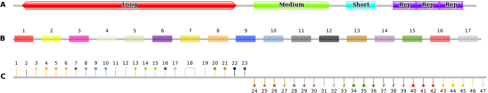

## Input

### Protein ID
Directly use a UniProt or NCBI GenPept identifier to automatically retrieve features listed at these databases for your protein. For example, if you want to look up CD45:
* Select the **Database** you want and **Search with ID** entering either `P08575` or `NP_002829.3` for UniProt or NCBI GenPept, respectively.
* You can specify which featurures to include in the results: *regions*, *motifs* or *markups*. By default, all are selected, which is the recommended way. Selecting just *markups*, for example, can be useful if you want to focus on that particular feature.

### Protein features
Provide metadata of your protein, such as: **Name**, **Length** in amino acids, database **ID** if applicable, **Species** your protein is from and the corresponding **Taxid**, as well as a **Link** to external resource, such as database. This information is used for both **Predicted** and **Predefined** results/features processing. 

#### Protein features → Predicted (raw results)
Process the raw results from several web-based resources for protein features prediction. Here, the human CD45 amino acid sequence ([P08575.fasta](cd45/P08575.fasta)) was used as an example. 
* [**S.M.A.R.T.**](http://smart.embl-heidelberg.de/) -- the Simple Modular Architecture Research Tool. Upon feature prediction, copy the results that show *Confidently predicted domains, repeats, motifs and features*, without headers ([screenshot example](cd45/smart.png), green rectangle). Paste in a text editor and save to a simple text file, e.g. as [cd45_SMART.tsv](cd45/cd45_SMART.tsv).
* [**E.L.M.**](http://elm.eu.org/) -- The Eukaryotic Linear Motif resource for Functional Sites in Proteins. Upon motifs prediction, copy the data of *Results of ELM motif search after globular domain filtering, structural filtering and context filtering* ([screenshot example](cd45/ELM.png)). Paste in Excel or equivalent program and save, e.g. as [cd45_ELM.xlsx](cd45/cd45_ELM.xlsx). If available, download the conservation scores file (called misleadingly [phosphosite features](cd45/ELMcs.png)), as e.g. [cd45_ELMcs.tsv](cd45/cd45_ELMcs.tsv). 
* [**ANCHOR2**](https://iupred.elte.hu/) -- Prediction of Intrinsically Unstructured Proteins (binding sites). Select Analysis type: *ANCHOR2*, then download results as `Text`, no column headers, and save as e.g. [cd45_AIPred.tsv](cd45/cd45_AIPred.tsv) (new!) or [cd45_IUPred3.tsv](cd45/cd45_IUPred3.tsv) depending on the analysis.
* [**NetNGlyc**](https://services.healthtech.dtu.dk/services/NetNGlyc-1.0/) -- N-linked glycosylation sites in human proteins. After the search is complete, copy the results without headers, or dashed lines ([screenshot example](cd45/NetNGlyc.png), green rectangle). Paste in a text editor and save to a simple text file, e.g. as [cd45_NetNGlyc.tsv](cd45/cd45_NetNGlyc.tsv). 
* [**NetOGlyc**](https://services.healthtech.dtu.dk/services/NetOGlyc-4.0/) -- O-GalNAc (mucin type) glycosylation sites in mammalian proteins. After search is complete, copy the gff contents only ([screenshot example](cd45/NetOGlyc.png), green rectangle).  Paste in a text editor and save to a simple text/gff file, e.g. as [cd45_NetOGlyc.gff](cd45/cd45_NetOGlyc.gff). 
* [**NetPhos**](https://services.healthtech.dtu.dk/services/NetPhos-3.1/) -- Generic phosphorylation sites in eukaryotic proteins. Select as *Output format*: `classical`. After the search is complete copy from the results block the following ([see screenshot example](cd45/NetPhos.png), green rectangle). Paste in a text editor and save to a simple text file, e.g. as [cd45_NetPhos.tsv](cd45/cd45_NetPhos.tsv).   
* [**ScanSite**](https://scansite4.mit.edu/#scanProtein) -- Scan Protein for Motifs. If you submit amino acid sequence, make sure you do **not** paste the fasta header. From the *Additional analyses* section, *Download* results as tab-separated file, save as e.g. [cd45_ScanSite.tsv](cd45/cd45_ScanSite.tsv).

#### Protein features → Predefined (curated table)
Provide a user-prepared table with protein topology annotations. File should have the following columns, in the given order:
* `type`: classification of the feature (string). Accepted are: `regions`, `motifs` or `markups`.
* `start`: start coordinate (numeric).
* `end`: stop/end coordinate (numeric). If you denote a markup site, use the same coordinate for `start` and `end`, do *not* leave this blank.
* `text`: short name of feature (string).
* `description`: longer description of feature (string).
* `scoreName`: if feature was predicted, name of the prediction score (string). *Optional*
* `score`: actual score value (numeric). *Optional*
* `database`: source of feature information (string). *Optional*
* `accession`: database identifier of feature (string). *Optional*
* `sequence`: actual sequence of feature, as amino acids or regex (string). *Optional*
* `target`: if a feature interacts with another partner, indicate partner (string). *Optional*

Supported formats are: 
* Microsoft Excel (xlsx), e.g. [cd45_custom.xlsx](cd45/cd45_custom.xlsx) 
* tab-separated values (TSV) text file 
* comma-separated values (CSV) text file 

The **keywords** used by ProToDeviseR to classify regions, motifs and markups are [listed here](./keywords.txt).

## Output 
### Table preview
An interactive table featuring your results. Useful if you want to combine different search strategies and/or manually curate the features of your protein. Downloadable as `xlsx`.

### JSON output
Shows the generated JSON code for the topology of your protein. Can be copied to **clipboard**, ready to paste in the *Image generator tab*. Downloadable as `json`.  
* **Regions**. At the moment, ProToDeviseR assigns regions colours *anew* for each protein (Figure 1a). A rainbow gradient is used, where regions with the same name will have the same colour. Please note that, although coloured the same within one protein, regions may have another colour assigned to them in another protein. Shapes are:
  * pointed: long regions (> 200 amino acids)
  * curved: medium-sized regions (35-200 amino acids)
  * straight: small regions (< 35 amino acids)
  * jagged: short regions designated as *repeats* (< 70 amino acids)
* **Motifs**. Most common motifs and other unstructured regions are covered (Figure 1b).
* **Markups**. Most common post-translational modification sites and other sites features are covered (Figure 1c).

 

**Figure 1. Protein features.** **A) Regions.** Long, medium, short and three repeats. **B) Motifs.** Signal peptide (1), Coiled coil (2), Low complexity (3), Intrinsic disorder (4), Intrinsically disordered binding (5), Charged or polar amino acids patch (6), Phosphorylation motif (7), Glycosylation motif (8), Transmembrane part (9), Lipidation motif (10), Cleavage motif (11), Degradation motif (12), Targeting motif (13), Nuclear localisation or export motif (14), Docking, ligand or binding motif (15), Activity-related motif (16), Other motif (17). **C) Markups.** N-glycosylation (1), O-glycosylation (2), Glycosaminoglycan (3), C-mannosylation (4), O-fucosylation (5), Glycosylation unspecified (6), Hydroxylation (7), Prenylated (8), Acylated (9), GPI (10), Lipidation (11), Acetylation (12), Methylation (13), Amidation (14), Pyrrolidone carboxylic acid (15), Sulfation (16), D-isomerization (17), di-Sulfide bond (18), Cross-linking (19), Sumoylation (20), Ubiquitination (21), Degradation (22), Cleavage (23), Sorting (24), Targeting (25), Retaining (26), Absorption (27), Nuclear import (28), Nuclear export (29), Nuclear receptor (30), Nuclear-related (31), DNA-binding (32), Binding site (33), Ligand binding (34), Ligand site (35), Docking (36), Interacts with (37), Flavin-binding (38), Co-factor (39), Active site (40), Catalytic activity (41), Activity regulation (42), Phospho-Serine (43), Phospho-Threonine (44), Phospho-Tyrosine (45), Phosphorylation unspecified (46), Other motif (47).

### Image generator
Paste here the json code from the *JSON output* tab in order to render a graphical scheme of your protein. Graphic adjustments:
* **Image size (scale)**: This scales the generated image up and down. Useful, if you need to export high resolution pictures.
* **Amino acid size (pixels)**: Specifies how many pixels are used to represent a single residue (default is `0.5`). Scheme can be made wider or shorter, without scewing and distorting the image. Useful for short proteins or when features are too tightly packed together.
* **Motif opacity (alpha)**: transparency of the motifs (default is `0.6`). If you want motifs to stand out more, increase this value. To hide them completely, set it to `0`.
* **Load examples**: a *simple* and a *complex* JSON codes examples are provided.
* **To save**, right click on the generated image.  

## Example work strategy 
1. Scan both UniProt and NCBI for features already listed in these databases. Download the results from both as tables. 
2. Do predictions at the online resources, then load and process them. Download the results as a table. 
3. Combine all the three tables generated. Inspect and curate the results, then save.
4. Load and process the manually curated table of features to generate your custom graphics file. 
 
## Editing the JSON file
You can manually edit the produced JSON file after download. For example, if you are analysing several proteins, you may wish to have the same colour for domains of the same type, but found in the different protein. The JSON syntax is extensively covered [elsewhere](https://pfam-docs.readthedocs.io/en/latest/guide-to-graphics.html#domain-graphics-tool).
