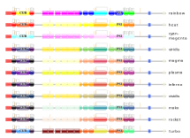

## Input

### Protein ID
Directly use a UniProt or NCBI GenPept identifier to automatically retrieve features listed at these databases for your protein. For example, if you want to look up CD45:
* Select the **Database** you want and **Search with ID** entering either `P08575` or `NP_002829.3` for UniProt or NCBI GenPept, respectively.
* You can specify which featurures to include in the results: *regions*, *motifs* or *markups*. By default, all are selected, which is the recommended way. Selecting just *markups*, for example, can be useful if you want to focus on that particular feature.

### Protein features
Provide metadata of your protein, such as: **Name**, **Length** in amino acids (**required**), database **ID** if applicable, **Species** your protein is from and the corresponding **Taxid**, as well as a **Link** to external resource, such as database. This information is used for both **Predicted** and **Predefined** results/features processing. 

#### Protein features → Predicted (raw results)
Process the raw results from several web-based resources for protein features prediction. Here, the human CD45 amino acid sequence ([P08575.fasta](cd45/P08575.fasta)) was used as an example. 
* [**SMART**](http://smart.embl-heidelberg.de/) -- the Simple Modular Architecture Research Tool. Copy the results that show *Confidently predicted domains, repeats, motifs and features*, without headers ([screenshot](cd45/smart.png)) and save as a text file, e.g. [cd45_SMART.tsv](cd45/cd45_SMART.tsv).
* [**ELM**](http://elm.eu.org/) -- The Eukaryotic Linear Motif resource for Functional Sites in Proteins. Copy the data of *Results of ELM motif search after globular domain filtering, structural filtering and context filtering* ([screenshot](cd45/ELM.png)), paste in Excel or equivalent and save as XLSX, e.g. [cd45_ELM.xlsx](cd45/cd45_ELM.xlsx). If available, download the conservation scores file, called misleadingly "phosphosite features" ([screenshot](cd45/ELMcs.png)), and save as a e.g. [cd45_ELMcs.tsv](cd45/cd45_ELMcs.tsv). 
* [**Anchor2**](https://iupred.elte.hu/) -- Prediction of Intrinsically Unstructured Proteins binding sites. Select Analysis type *Anchor2*, coupled to AIUPred or the old IUPred3, get results as `Text`, copy without column headers ([screenshot](cd45/AIUPred.png)) and save as a text file, e.g. [cd45_AIUPred.tsv](cd45/cd45_AIUPred.tsv) or [cd45_IUPred3.tsv](cd45/cd45_IUPred3.tsv).
* [**NetNGlyc**](https://services.healthtech.dtu.dk/services/NetNGlyc-1.0/) -- N-linked glycosylation sites in human proteins. Copy the results without headers ([screenshot](cd45/NetNGlyc.png)) and save as a text file, e.g. [cd45_NetNGlyc.tsv](cd45/cd45_NetNGlyc.tsv). 
* [**NetOGlyc**](https://services.healthtech.dtu.dk/services/NetOGlyc-4.0/) -- O-GalNAc glycosylation sites in mammalian proteins. Copy the gff results without headers ([screenshot](cd45/NetOGlyc.png)) and save as a text file, e.g. [cd45_NetOGlyc.gff](cd45/cd45_NetOGlyc.gff). 
* [**NetPhos**](https://services.healthtech.dtu.dk/services/NetPhos-3.1/) -- Generic phosphorylation sites in eukaryotic proteins. Select as *Output format*: `classical`, copy from the results without headers ([screenshot](cd45/NetPhos.png)) and save to a text file, e.g. [cd45_NetPhos.tsv](cd45/cd45_NetPhos.tsv).   
* [**ScanSite**](https://scansite4.mit.edu/#scanProtein) -- Scan Protein for Motifs. If you submit amino acid sequence, make sure you do **not** paste the fasta header. From the *Additional analyses* section, *Download* results as tab-separated file, save as e.g. [cd45_ScanSite.tsv](cd45/cd45_ScanSite.tsv). 

#### Protein features → Predefined (curated table)
Provide a user-prepared table with protein topology annotations. File should have the following columns, in the given order:
* `type`: classification of the feature (string). Accepted are: `regions`, `motifs` or `markups`.
* `start`: start coordinate (numeric).
* `end`: stop/end coordinate (numeric). If you denote a markup site, use the same coordinate for `start` and `end`, do *not* leave this blank.
* `text`: short name of feature (string).
* `description`: longer description of feature (string).
* `scoreName`: if feature was predicted, name of the prediction score (string). *Optional*
* `score`: actual score value (numeric). *Optional*
* `database`: source of feature information (string). *Optional*
* `accession`: database identifier of feature (string). *Optional*
* `sequence`: actual sequence of feature, as amino acids or regex (string). *Optional*
* `target`: if a feature interacts with another partner, indicate partner (string). *Optional*

Supported formats are: 
* Microsoft Excel (xlsx), e.g. [cd45_custom.xlsx](cd45/cd45_custom.xlsx) 
* tab-separated values (TSV) text file 
* comma-separated values (CSV) text file 

The **keywords** used by ProToDeviseR to classify regions, motifs and markups are [listed here](./keywords.txt).

### Colour gradient for domains
A number of colour chemes for domains can be chosen by the user, upon clicking the "Submit" button. As a demonstration, we analysed multidomain Human Attractin-like protein 1 (Figure 1).

  
**Figure 1. ProToDeviseR offers 11 colour-schemes for domains.** Human Attractin-like protein 1 (ATRN1_HUMAN of 1379 (aa), UniProt ID: Q5VV63) was analysed, using each gradient.

## Output 
### Image generator tab
The generated code will appear in the box. In order to render a graphical scheme of your protein, just click the green button saying "Generate graphic from JSON code". Graphic adjustments:
* **Image size (scale)**: This scales the generated image up and down. Useful, if you need to export high resolution pictures.
* **Amino acid size (pixels)**: Specifies how many pixels are used to represent a single residue (default is `0.5`). Scheme can be made wider or shorter, without scewing and distorting the image. Useful for short proteins or when features are too tightly packed together.
* **Motif opacity (alpha)**: transparency of the motifs (default is `0.6`). If you want motifs to stand out more, increase this value. To hide them completely, set it to `0`.
* **Load examples**: a *simple* and a *complex* JSON codes examples are provided.
* **To save**, right click on the generated image.  

Results can be downloaded as JSON code (can be copied to clipboard as well) or a table.

### Table tab
Contains a preview of the protein features as a dynamic table.

## A more sophisticated work strategy
### Compare UniProt and NCBI results 
1. Scan both UniProt and NCBI for features already listed in these databases. 
2. Download the results from both, as tables (xlsx). 
3. Combine results in a single spreadsheet and inspect the overlap of domains and other features.
4. Curate the results and save as a new table.
5. Load and process the manually curated table of features to generate your custom graphics file. 

### Include predicted features
1. Additionally, do predictions at the online resources, then load and process them. 
2. Download the results as a table.
3. Combine with the table from above (step 4 above), adding up missing features.
4. Curate the results and save as a new table.
5. Load and process the manually curated table of features to generate your custom graphics file. 
 